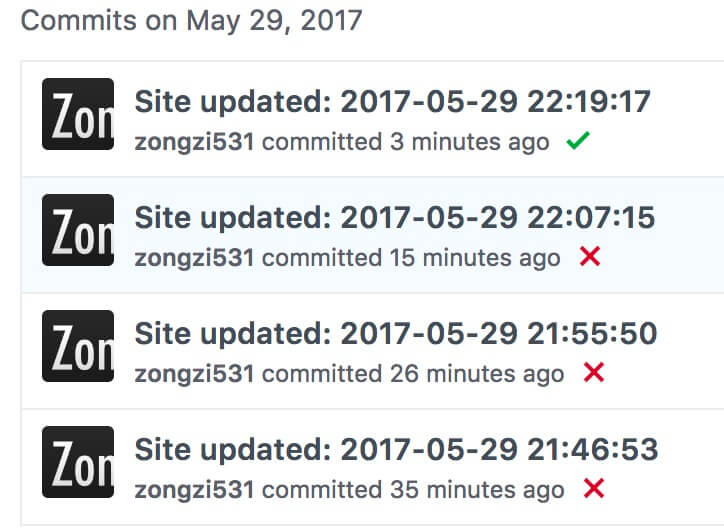

<!-- no node  -->

<!-- more -->

>那么首先先摄影一张

好了，那么新电脑拿到要做什么呢。

当然是迁移原设备的文件呀，那么有意思的来了，我第一想到的就是U盘。当我的手摸向U盘的时候，我停下了我的手，然后我朝着U盘笑了。

**要问为什么？**


哈哈哈，应该可以笑很久吧。OK，我笑点低。

那么就是不想依靠外网这种低能手段解决这个事情，抄起键盘就是干啊，用`SMB`访问了Windows的共享文件夹，很开心的开始了迁移。

文件也迁移完了，软件也基本把能想到的都装好了。

博客迁移因为`node_modules`笨重的原因，我都是迁移过来后`npm install`的。

但是在启动本地`hexo server`的时候又报错了，天呐。

```bash
{ [Error: Cannot find module './build/Release/DTraceProviderBindings'] code: 'MODULE_NOT_FOUND' }
{ [Error: Cannot find module './build/default/DTraceProviderBindings'] code: 'MODULE_NOT_FOUND' }
{ [Error: Cannot find module './build/Debug/DTraceProviderBindings'] code: 'MODULE_NOT_FOUND' }
```

尝试了网上各种解决方法，都不行。当然出现这个问题应该是我直接`npm install`造成的，虽然`hexo`暂时并没有用到`dtrace-prodider`，但是对于有强迫症的我，看到报错真的很心烦。

最后呢用最老实的方法，重新安装了`hexo-cli`、`hexo`、`hexo-util`，但是呢，没有办法启动`hexo server`，那么单独安装了`hexo server`以为成了，结果页面不会更新。

怀着忐忑的心情按下了`npm install`，这下竟然好了……我也不知道为什么，好了……，然后查了下`npm list`发现没了`dtrace-prodider`，神奇！

还有就是我发布的时候遇到的问题`Failure: XXX is not a recognized Liquid tag.`  ， 记得 `hexo clean`一下，可能是因为以前Windows的数据导致上GitHub页面生成失败三次的。



这样，基本的一台可以科学上网的MacBook躺在怀里了，我可以拿来撸代码了。

接下来，就是去买**转接头**啦！！

最后，我爱听音乐，新款的扬声器跟老款的比起来的确不一样些，不过很有意思啦。献上最近挺喜欢的一首歌：

<iframe frameborder="no" border="0" marginwidth="0" marginheight="0" width=330 height=86 src="//music.163.com/outchain/player?type=2&id=26631930&auto=1&height=66"></iframe>

来，谈谈新工作新公司2周的感觉吧。

**很喜欢！**

开始接手公司一些的前端项目，慢慢熟悉公司、同事，一个很好的开始。

总之，在做好工作的同时，不断的提升自己的技术。