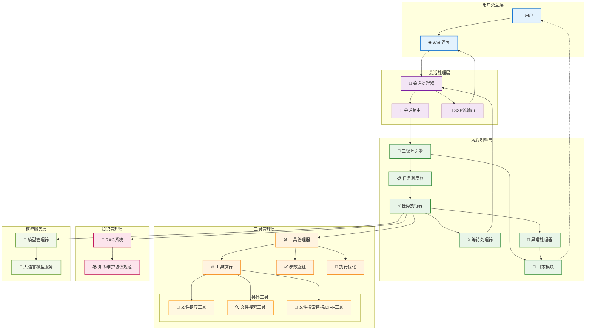

<!-- no node  -->

<!-- more -->

这个月基本围绕着之前的 WebContainer 去实现一个 Agent ，也算是负责 Agent 核心开发了。

Agent 的设计从最初简单的工具调用、冗长上下文演变成任务能够分模块执行，自由的编排各个任务的执行顺序（代码层面，非UI拖拽）。

从原先一大坨业务固定的代码演变成各个任务只需关注自身和其上下文即可，这个月可算是从基本实现到升级解耦全做了个遍。

目前设计的 Agent 架构信息如下：

## Agent 架构设计图

## 架构层次说明

### 🔄 核心引擎层
- **主循环引擎**: 整个Agent的核心控制器，协调各个模块的工作
- **任务调度器**: 负责任务的排队、优先级管理和调度执行
- **任务执行器**: 具体执行各种任务，包括工具调用和模型推理
- **等待处理器**: 处理需要用户交互的场景，如确认、回复等
- **异常处理器**: 统一的异常捕获和处理机制
- **日志模块**: 记录系统运行状态和调试信息

### 💬 会话处理层
- **会话处理器**: 管理用户会话的生命周期
- **会话路由**: 根据请求类型路由到不同的处理逻辑
- **SSE流输出**: 实现实时的流式响应输出

### 🛠️ 工具管理层
- **工具管理器**: 统一管理所有可用工具
- **工具执行**: 安全地执行各种工具操作
- **参数验证**: 确保工具调用参数的正确性
- **执行优化**: 优化工具执行性能和资源使用

### 🧠 知识管理层
- **RAG系统**: 检索增强生成，提供上下文相关的知识
- **知识维护协议**: 规范化的知识更新和维护机制

### 🤖 模型服务层
- **模型管理器**: 管理不同的AI模型实例
- **大语言模型服务**: 提供统一的模型推理接口

## 数据流向

1. **用户请求**: 用户通过Web界面发起请求
2. **会话处理**: 会话处理器接收并路由请求
3. **任务调度**: 主循环引擎调度相应的任务
4. **工具执行**: 根据需要调用各种工具完成任务
5. **模型推理**: 利用大语言模型进行智能处理
6. **结果返回**: 通过SSE流实时返回处理结果

这种架构设计实现了模块化、可扩展的Agent系统，各个组件职责清晰，便于维护和升级。

可以说整个月是游走在 Agent 开发和 Prompt 调试之间，以开发、产品多重角色优化项目中。
