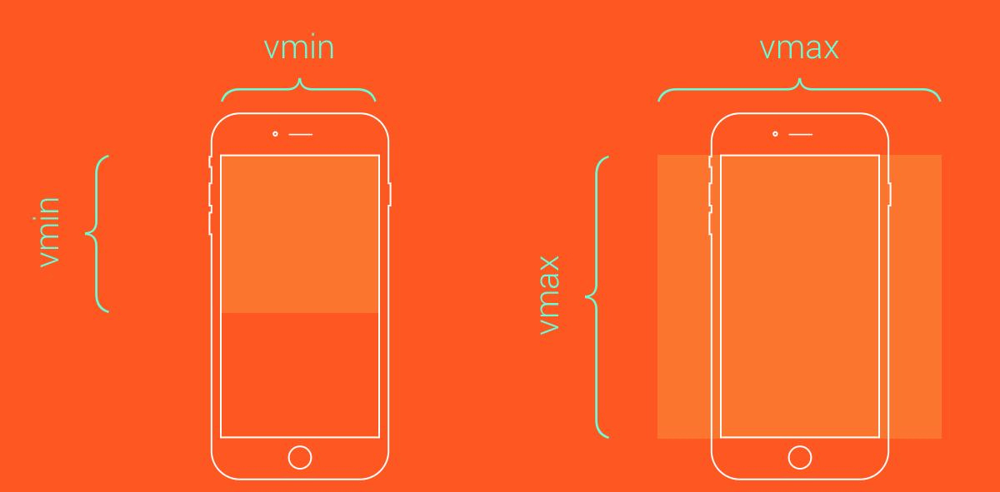

<!-- no node -->

<!-- more -->

主要介绍下移动端自适应的一些常用单位，比如：rem、vw、vh，配合传统的px、百分比、`<viewport>`标签，兼容适配移动端的各种分辨率的手机端。

## 单位介绍

* `rem`：root emphasize，根元素的font-size。
* `vw`：1vw = 1%屏幕宽度。
* `vh`：1vh = 1%屏幕高度。
* `vmin`、`vmax`：关于视口高度和宽度两者的最小值或者最大值。



## 适配

以下假定已经存在一个使用px单位，且完全适配320xp宽度手机的页面。

### 1.改变viewport的initial-scale的数值

比如适配的目标的宽度为400px

```css
initial-scale=1.25 // 400/320=1.25
```

但这里有个缺点，就是得提前知道所适配的设备的尺寸,然后服务端根据userAgent来判断。

```html
    <% if(device === 1){ %>         <meta name="viewport" content="width=device-width,initial-scale=1.0,maximum-scale=2.0,user-scalable=no" />     <% } %>
    <% if(device === 2){ %>         <meta name="viewport" content="width=device-width,initial-scale=1.5,maximum-scale=2.0,user-scalable=no" />     <% } %>
```

或者使用js计算缩放比例 ,然后替换initial-scale的值

```javascript
var scale =  screen.width/320,
    viewport =  document.querySelector('meta[name=viewport]');
    viewport.setAttribute('content', viewport.getAttribute('content').replace(/(initial-scale)=[\d\.]?\d/,'$1='+scale));
```

但使用js会有滞后性，页面会多渲染一次，且会导致页面闪烁

>首屏渲染 -> js改变initial-scale -> 二次渲染，页面放大(闪烁)

### 2.替换px转而使用rem


设定父盒子的css为

```css
父盒子{
  width: 320px;
}
```

设置根元素的font-size为屏幕的某个比例

```css
html {
  font-size: 16px;
}
```

那么父盒子的css为

```css
父盒子{
  width: 20rem; //换算为320px，充满屏幕宽度
  height: 10rem; //换算为160px，盒子比例达到1:1
}
```

但是css的替换以及rem的计算还是比较繁琐的，这里建议使用sass的函数然后使用正则替换

```javascript
(/(\d+[\.\d+]?px)/g,'rem($1)')
$baiscRem:320px / 20 //这里假定为页面做20个等分 
@function rem($px) @return ($px / $basicRem) * 1rem 
父盒子
	width: rem(320px);
```

然后，使用css @media查询，确定rem的值。这里就比较具体了，需要根据实际的业务需求来决定所要适配的设备尺寸

```css
/* media.css */ 
@media screen and (min-width:320px) and (max-width:320px) {
	html{
		font-size: 320 / 320 * $basicRem;
	}
}
@media screen and (min-width:400px) and (max-width:400px) {
	html{
		font-size: 400 / 320 * $basicRem;
	}
}
```

>tips：如果不知道要兼容什么样的设备。可以再用户访问后，javascript收集该设备的相关信息，然后在服务端自动更新该文件的内容，加入新的@media规则。

### 3.关于vw，vh


宽高的1%，建议使用在各种布局的容器上，如上图的父盒子和子盒子。

```css
父盒子 {
	box-sizing: border-box;
	padding: 10vw;
	width: 100vw;
	height: 50vw;  /* 妥妥的2:1比例 */
	letter-spacing: -4px; /*消除行内元素的4px的空白间隔 */
} 
子盒子1,子盒子2 {
	margin: 0 5vw;
	width: 30vw;
	height: 30vw;  /* 妥妥的1:1的比例 */
	display:inline-block ;
}
```

相比rem，使用vw和wh是非常直观的，让其他人看到就能知道，该界面是以怎么样的结构进行布局，利于维护。

但在具体深入到表现的地方，建议转而使用rem来配合。

## 总结

其中涉及的单位和元素较多，其实如果仅仅为了达成相同的页面效果，它们之间都可以相互替代。甚至使用最原始的px，配合js的计算，也能够做到相同的事情。

这是一个探索的过程，每个人喜好不一致，采用的方式也不尽相同。基于浏览器提供了丰富的方法，针对具体问题，具体分析，不停地尝试，最终找到最合适的方案。


